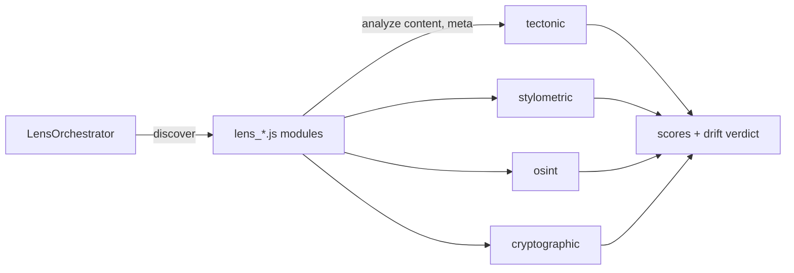

# zedra-sovereign — agentic lens experiment over zedra

<div align="right">


</div>

## Why should you care?

A small public repo holding an **agentic lens experiment**: auto-discovered
analysis modules (`lens_*.js`) that score repository health, fingerprint
authorship, recon infrastructure, and detect cryptographic artifacts — run
through a `LensOrchestrator` (`v2.0.0-agentic`) plus lens-first CI that fails
the build when repo health drifts. Alongside it: notes and helper scripts
around [zedra](https://github.com/tanlethanh/zedra), the phone-side Zed agent —
including a 2026-07-20 audit of its mobile GPUI app and e2e-encrypted host
daemon. It is **not** a zedra mirror.

**License:** none declared (experiment + notes) · **Security:** never hardcode secrets — inject via env or a vault

## Features

- **LensOrchestrator** — auto-discovers `lens_*.js` modules and runs them against content; each lens exports `{ name, description, analyze(content, meta) }`
- **Four lenses** — tectonic (repo health + drift), stylometric (authorship attribution), osint (infra recon + forensics), cryptographic (artifact + entropy detection)
- **Agentic Lens-First CI** — runs on push, PRs, and manually; bun when `package.json` exists, node fallback
- **Tectonic Drift Detection** — daily cron scores repository health and fails the run below threshold (default 50)
- **zedra AUDIT.md** — crate layout of `tanlethanh/zedra`: mobile GPUI app (Android/iOS) + `zedra-host` relaying editor/terminal/git/AI over an e2e-encrypted iroh P2P tunnel

## The lenses

| Lens | What it does |
|---|---|
| `tectonic` | Repository health scoring and drift detection |
| `stylometric` | Linguistic fingerprinting and authorship attribution |
| `osint` | Infrastructure reconnaissance and digital forensics |
| `cryptographic` | Cryptographic artifact detection and entropy analysis |

## How it works



## Quick start

```bash
git clone https://github.com/toxicwind/zedra-sovereign.git
cd zedra-sovereign
```

```js
const { LensOrchestrator } = require('./lib/lens-orchestrator');
const orch = new LensOrchestrator();          // or { lensDir: '...' }
await orch.discover();                        // finds lens_*.js
const all = await orch.analyzeAll(content);   // run every lens
const one = await orch.analyze('tectonic', content, { lastPush, repo });
```

## Configuration

`.env.example` documents the knobs: `LENS_ENABLED`, `LENS_SWARM_CONCURRENCY`,
`SWARM_MAX_CONCURRENCY`, `SWARM_TIMEOUT_MS`, `LENS_AUTO_COMMIT`, and
`ZEDRA_DAEMON_HOST` (default `localhost:17357`). Never hardcode secrets —
inject via env or a vault.

## CI

- **Agentic Lens-First CI** (`.github/workflows/agentic-lens-ci.yml`) — push to `main`, PRs, manual. Discovers lenses, runs the perception pipeline.
- **Tectonic Drift Detection** (`.github/workflows/tectonic-drift.yml`) — daily cron (`0 6 * * *` UTC) plus manual. Scores repo health via the tectonic lens; fails below threshold (default 50). Note: currently targets the `effusion-labs` repo by name.

## Machine-local scripts (awrawr-pc only)

These hardcode `/home/toxic/...` paths and will **not** work for anyone else:

- `check-zedra-host.sh` — `cd`s into the local `zedra-tanlethanh` checkout and runs `cargo check -p zedra-host`
- `fetch-vendor.sh` — clones the `tanlethanh/zed` fork (`feat/gpui-mobile` branch, pinned commit) into local `vendor/zed`

The `:25104` binding mentioned in `AUDIT.md` refers to a machine-local wrapper
(`~/.local/bin/zedra-ai-wrapper.sh`, not in this repo) that points the daemon's
`AiPrompt` RPC at the local sovereign router.

## What this repo is not

- Not a mirror of zedra: no Rust, no GPUI, no `Cargo.toml` here
- No host daemon ships in this tree
- Helper scripts are author-machine-local by design

## License & security

No license file ships in this repo. Secrets are never hardcoded — everything
sensitive arrives via environment or vault, per `.env.example`.
